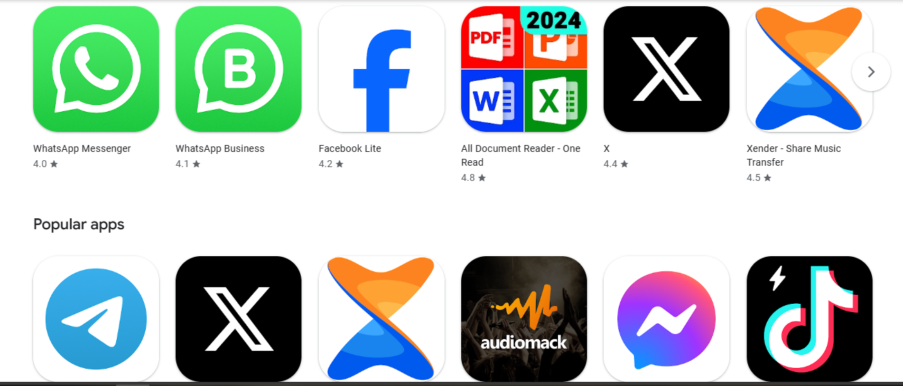
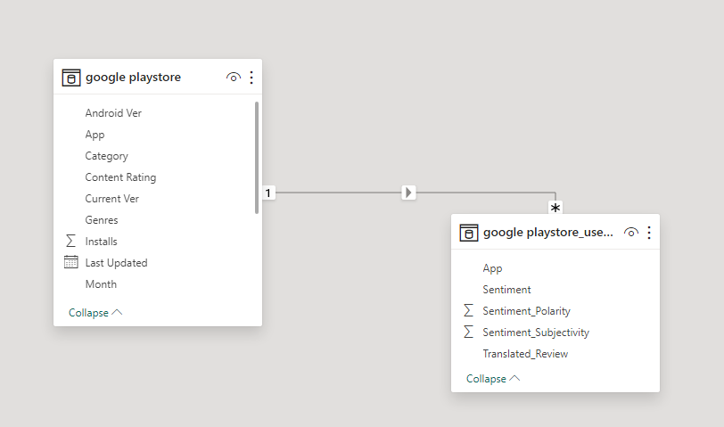
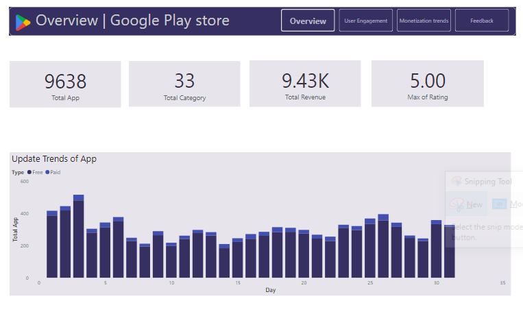
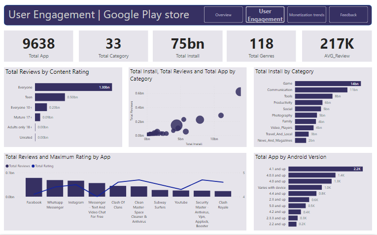
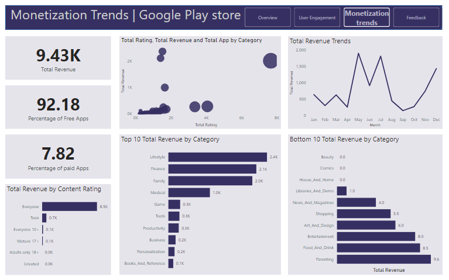
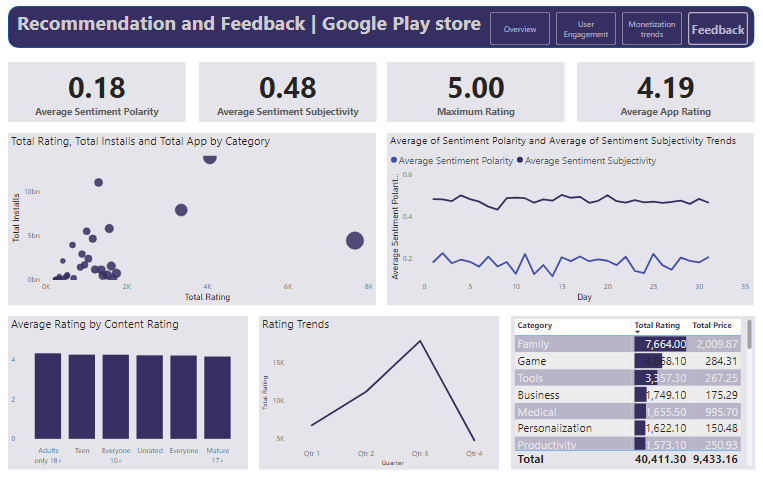

# Google-Playstore-Analysis

## Introduction

This is a PowerBI Project on **Google Playstore Analysis** which was scrapped from Google Playstore.
The project is to analyse and drive app-making businesses to success and draw actionable insights for developers to work on and capture the Android market!.

## Cleaning

The data was scrapped from Google Playstore where it comes with some errors,duplicates and errors within names. Every column was looked into by confirming the data types,errors,duplicates and replacing them if necessary of the two tables and making them okay for our analysis.

## Problem Statement

1. What are the update trends of apps?
2. What is the total reviews of content rating?
3. What is the correlation between total install and total review of app by each category?
4. what is the total install by category?
5. What is the highest review and maximum rating of each app?
6. What is the total app of each andriod version
7. What is the highest review of each content rating
8. What is the correlation between total rating and total revenue of each category and their total app?
9. What are app revenue trends?
10. what is the top 10 and bottom 10 revenue of each category?
11. What is the correlation between total rating,total installs of each category and their total app?
12. What is the average polarity and average subjectivity trends?
13. what is the average rating by content rating?
14. WHat are the rating trends?
15. How is the category,rating and total price bringing income?

## Skill demonstrated

The following PowerBI features are used:
- Modelling,
- DAX,
- Page Navigation,
- Filter,
- Quick Measure,
- Button

## Modelling

The Dataset is of two table,where one contain the **App Usage** and the other contain the **User_Review** content.

It was model as one to many relationship.

## Visualization

This report comprises of 4 page:
1. Overview
2. User Engagement
3. Monetization and Market Trends
4. Recommendation and Feedback

You can interact with the report [here](https://app.powerbi.com/view?r=eyJrIjoiYjk3MjA3MTItOWQzNS00NjdjLWEyODItNTYyZjBmN2U3MjE2IiwidCI6ImRmODY3OWNkLWE4MGUtNDVkOC05OWFjLWM4M2VkN2ZmOTVhMCJ9)

Features
- The four tabs are buttons which can be used to navigate to the selected pages

## Analysis

### Overview:

There are currently 9638 app on playstore with 33 category as at 2018.
A total of 9.43K revenue was generated and maximum of 5.00 rating as at 2018.
There was a total of 5,946 of free app and 323 of Paid app in 2018,where app in july and quater 3 in the year 2018 was updatedly mostly.

### User Engagement:

A total of 75billion installation, average_review of 217k and genre of 118k.
It is seen that Game category has more installtion(14 billion).
There is also a strong relationship between total installation and total review of each category.
However, category(Facebook) has highest review,where clean master and security master has highest rating of 4.70.
It is notice that Teen content rating has more review due to Game they mostly download.

### Monetization and Market Trends:

A total of 9.43K revenue was generated as a 2018,where there is 92.18% of free app and 7.82% of paid app. 😄
It is obvious that Month of May generated 1,898.68, Quarter 2 generated 3055.46 and 2018 generated total of 4547.70 .
It is seen that lifestyle category generate the highest revenue(2,360.87) where beauty category generate none 🤓.
It is notice from our analysis that more rating does not attract more revenue,meaning the relationship is not strong.

### Recommendation and Feedback:

There is an average polarity of 0.18 which is not that strong and average subjectivity of 0.48 which is strong feedback.
It is seen that Adult only 18+ has the highest average rating(4.14) by content rating.
It is seen that there the rating trends has not been stable where Quater 3 take the lead with 17,806.40,July with 11,06.24 and 2018 with 26,563.90 as the highest rating trends

## Conclusion and Recommendation:

- The free app has higher engagement,features,review and download more than the paid app
- Most social app have high review and rating.
- Most app are build for the youth and Teen which drive more sales.
- Game and communication category have high installation.
- Lifestyle category take the lead of high generating category
- It is observed that they are increase in all features year by year,where 2018 takes the lead as the currrent year

## Recommendation:

with the data analyse, Playstore should look more into their paid app and find the strategy used for app to upsell the paid app

##  Thank you for taking your time.👏

